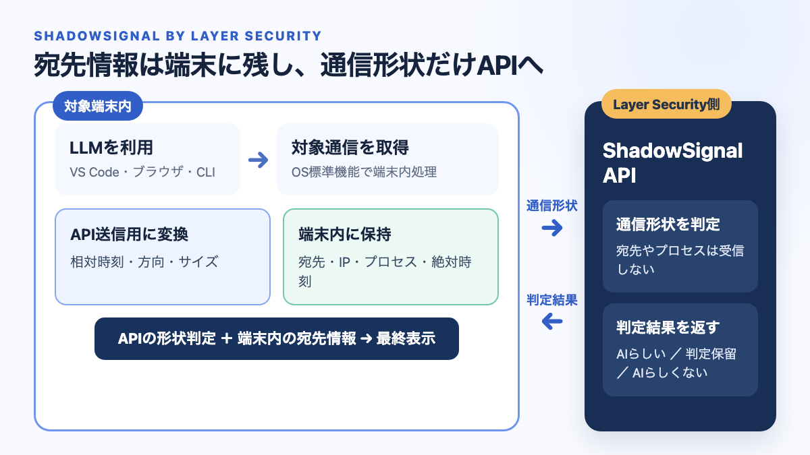
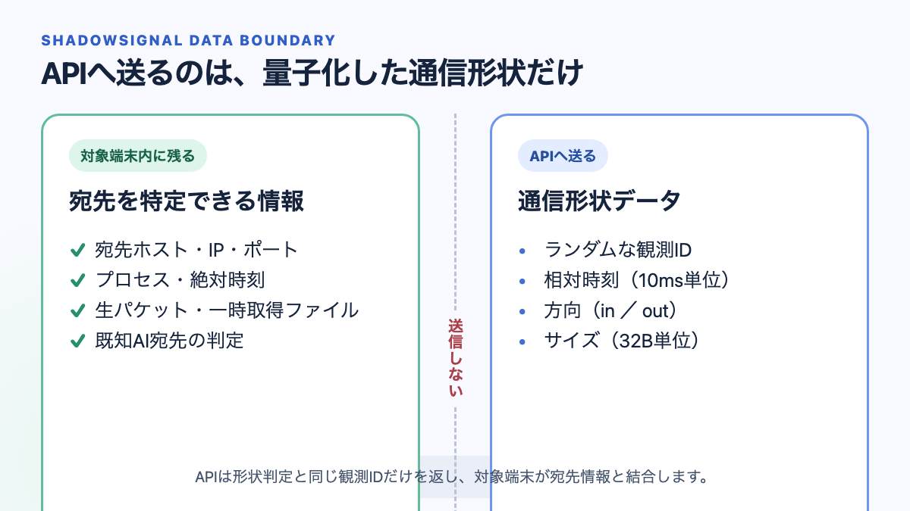

# ShadowSignal

ShadowSignalは、暗号化通信のサイズ・タイミング・方向から、生成AIサービスの利用兆候を
検知する技術デモです。通信内容は復号しません。

- API: <https://shadowsignal-api.layersecurity.jp>
- API仕様: <https://shadowsignal-api.layersecurity.jp/docs>
- データ収集仕様: [docs/DATA_COLLECTION.md](docs/DATA_COLLECTION.md)

## 構成





対象端末は、宛先情報とランダムな観測IDの対応を端末内に保持します。APIへは量子化した
通信形状データだけを送り、返された形状判定を端末内で宛先情報と結合します。

## データの取り扱い

APIへ送る情報：

- ランダムな観測ID
- 最初の対象イベントからの相対時刻（10ミリ秒単位）
- 通信方向（受信・送信）
- 暗号化データのサイズ（32バイト単位）

対象端末内に残す情報：

- 宛先ホスト、IPアドレス、ポート
- プロセス名と絶対時刻
- 生パケットと取得用の一時ファイル
- 既知の生成AIサービスとの対応情報

APIは同じ観測IDと形状判定を返します。APIへのリクエスト本文には、宛先、IPアドレス、
プロセス、通信内容を含めません。

## デモの実行

対応環境はWindows 10/11またはmacOS 13以降、Python 3.11以降です。パケット取得には
OSの管理者権限が必要です。

### Windows

管理者権限のPowerShellで実行します。

```powershell
git clone https://github.com/layer-security-jp/shadowsignal.git
cd shadowsignal
py -3.11 -m venv .venv
.venv\Scripts\python -m pip install .

$env:SHADOWSIGNAL_API_KEY = "別経路で提供されたAPIキー"
.venv\Scripts\shadowsignal dashboard
```

### macOS

```bash
git clone https://github.com/layer-security-jp/shadowsignal.git
cd shadowsignal
python3.12 -m venv .venv
.venv/bin/python -m pip install .

export SHADOWSIGNAL_API_KEY="別経路で提供されたAPIキー"
sudo -E .venv/bin/shadowsignal dashboard
```

起動後、ブラウザで45秒の計測を開始し、その間にVS CodeのClaude拡張機能またはブラウザの
生成AIサービスを利用します。ダッシュボードには、APIへ送った情報と端末内だけで扱う情報が
分けて表示されます。

## CLI

API接続を確認：

```bash
shadowsignal self-test
```

APIへ送信せず、送信予定のデータを確認：

```bash
shadowsignal capture \
  --target-host api.anthropic.com \
  --duration 45 \
  --dry-run
```

判定結果の例：

```json
{
  "final_verdict": "confirmed_ai_usage",
  "shape_verdict": "likely_llm",
  "confidence": "high",
  "vendor": "Anthropic",
  "product": "claude-code"
}
```

## 利用上の注意

- 監視権限を持つ端末とネットワークでのみ使用してください。
- 取得用の一時ファイルは端末内で解析後に削除し、APIへ送信しません。
- 通常のHTTPS通信と同様に、API基盤は接続元IPと接続時刻を観測し得ます。
- 本リポジトリは技術デモであり、検知保証や通信内容の検査を提供するものではありません。

## ライセンス

端末側クライアントはApache License 2.0です。ホストされた判定APIは対象外です。

セキュリティ上の問題は、公開Issueではなく`security@layersecurity.jp`へ連絡してください。
